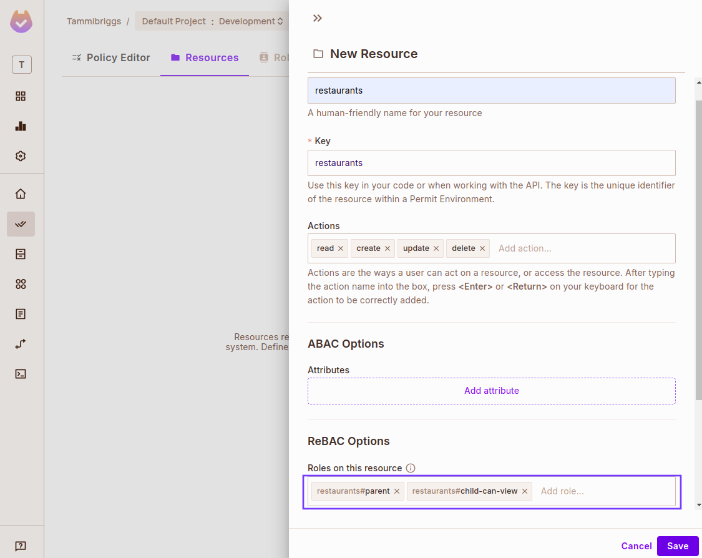
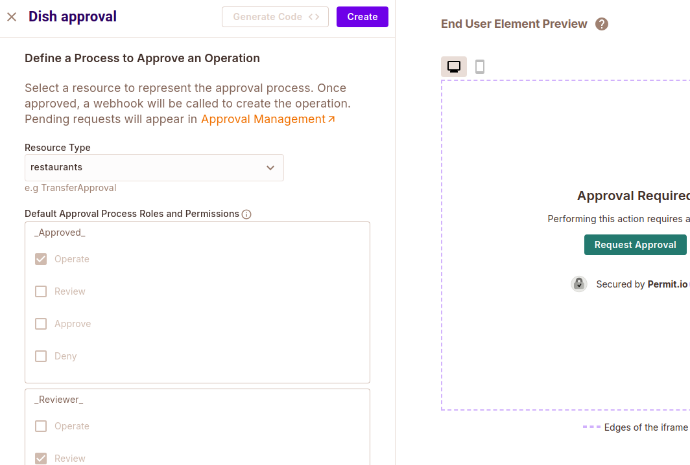
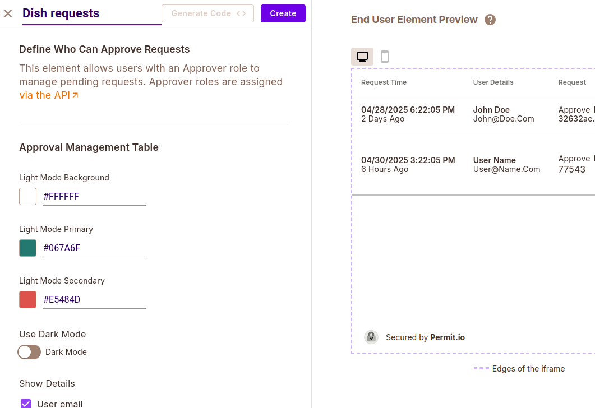

# Family Food Ordering System
The Family Food-Ordering CLI is a simple command-line interface that lets authenticated family members browse restaurants, place orders, and manage access—all powered by a Permit-based MCP server and an LLM backend.

**How it works**:
The system allows parents and children to order dishes from various restaurants, with some restrictions. Children can only access certain restaurants or dishes if they’ve been granted permission.

- To access restricted restaurants, children must submit an access request.
- For certain dishes, children must request one-time approval before they can order.

## Overview
This project is made up of three main layers:
1. **Custom MCP Server**:
A lightweight extension of the Permit MCP server that adds two tools:

- `list_dishes` – shows available meals.
- `order_dish` – places orders with permission checks and pricing rules.

2. **FastAPI Backend**:
The backend connects securely to the MCP server by spawning a subprocess. It passes user query and the available tools to a language model (Gemini), which handles natural language queries like “I want to order a pizza.” It exposes a WebSocket endpoint for real-time chat.

3. **CLI Tool**:
A command-line chat interface where users can log in and talk to the system. It sends user messages to the backend over WebSocket and displays responses. 

## Prerequisite
- Python >= 3.10
- `uv` >= 0.6.1
- Running instance of the [Local Permit PDP](https://docs.permit.io/how-to/deploy/deploy-to-production/#installing-the-pdp)

## Setting up Permit
Let's start by defining the resource we wish to create and manage access requests for, along with its access control policies and Elements.

Permit Elements is a set of prebuilt and embeddable UI components that provide fully functional access-control, enabling us to quickly setup access requests and operation approval flows in our system.

There are four types of Permit Elements: two for access request flows and the other two for operation approval.
- **Access Request Element**: Enable users to request access to restricted resources.
- **User Management Element**: To control which users are eligible to manage access requests submitted by others, based on their permission levels, and to approve or deny requests.
- **Operation Approval Element**: Enable users to request approval for a specific action on a resource.
- **Approval Management Element**: To manage operational approval requests.

Aside from been used as UI components, Permit Elements can also be interacted with via the Permit API, which is what is used to build the Permit MCP Server.

### Access Control Design
For our food ordering system, we'll define:
- A resource called "restaurant"
- Two roles, one for parents and the other for children who have access to a restaurant.
    - parent: Can create, read, update, and delete dishes in a restaurant.
    - child-can-view: Can only read dishes.
- A user management element called "Restaurant requests" to enable parents manage request send by children to access a resitricted restaurant.
- An operation approval element called "Dish approval" which will add two extra role to the restaurant resource (*Reviewer* and *Approved*). These roles will determine who can review an approval request and whose request has been approved.
- An approval management element called "Dish requests".

### Create a Resource
In your Permit dashboard, navigate to Policy > Resources, then click on the **Create a Resource** button. Name the resource "restaurants" and add these two ReBAC roles: "parent", "child-can-view'. 



In the **Policy Editor** tab, give the added ReBAC roles the following permissions:


### Create User Manangment Element 
Navigate to elements in the sidebar and create a user management element with the following values: 
  - Name: Restaurant requests
  - Configure elements based on: ReBAC Resource Roles
  - Resource Type: restaurants
  - Role permission levels: 
    - Level 1 - Workspace Owner: parent
    - Assignable Roles: child-can-view


Click **Create**. Then click on **Get Code** in the new user mananagment tab and you will see the element config ID "restaurant-requests". Take note of it as we will use it later on.


### Create Operation Approval Element
Create an operation approval element with the following values:
- Name: Dish approval
- Resource Type: restaurants



### Create Approval Management
Create an approval management element called "Dish requests". 



Get the element config ID "dish-requests" and take note of it as we will use it later on.

## Setting up our CLI project
Enter the following commands in the terminal to clone the project, create a virtual environment and install the dependencies.
```shell
git clone <repository_url>
cd examples/food-ordering-system
uv venv
source .venv/bin/activate # For Windows: .venv\Scripts\activate
uv pip install -e . 
```

Create a `.env` file in the root directory and specify the following variables: 

```shell
TENANT=  # e.g default
RESOURCE_KEY= # The key of the resource you want to manage access for.
PERMIT_PDP_URL=  # The local Permit PDP URL http://localhost:7766
PERMIT_API_KEY=
PROJECT_ID=
ENV_ID=
ACCESS_ELEMENTS_CONFIG_ID=
OPERATION_ELEMENTS_CONFIG_ID= 
GEMINI_API_KEY=
DB_NAME= # e.g food_ordering.db
```
You can use the following ressources to help with that: 
- [PERMIT_PDP_URL](https://docs.permit.io/how-to/deploy/deploy-to-production/#installing-the-pdp)
- [PERMIT_API_KEY](https://docs.permit.io/overview/use-the-permit-api-and-sdk#obtain-your-api-key)
- [PROJECT_ID](https://docs.permit.io/api/examples/get-project-and-env#get-project-id-or-key)
- [ENV_ID](https://docs.permit.io/api/examples/get-project-and-env#get-environment-id-or-key)
- [GEMINI_API_KEY](https://aistudio.google.com/app/apikey)

We will be using the local Permit PDP for this project instead of the cloud PDP as enables implement ReBAC authorization which is not yet avaialble in the cloud PDP.

## Runing the Project
To run the project, first start the FastAPI server using the following command: 

```shell
fastapi dev server.py
```
Next, run the CLI using the following command:

```shell
uv run client.py
```

You can login with the following username and password: 
```python
[
    {"username": "joe", "password": 'joe_password',  "role": "parent", },
    {"username": "jane", "password": 'jane_password', "role": "parent"},
    {"username": "henry",  "password": 'henry_password', "role": "child"},
    {"username": "rose",  "password": 'rose_password', "role": "child"},
]

```


