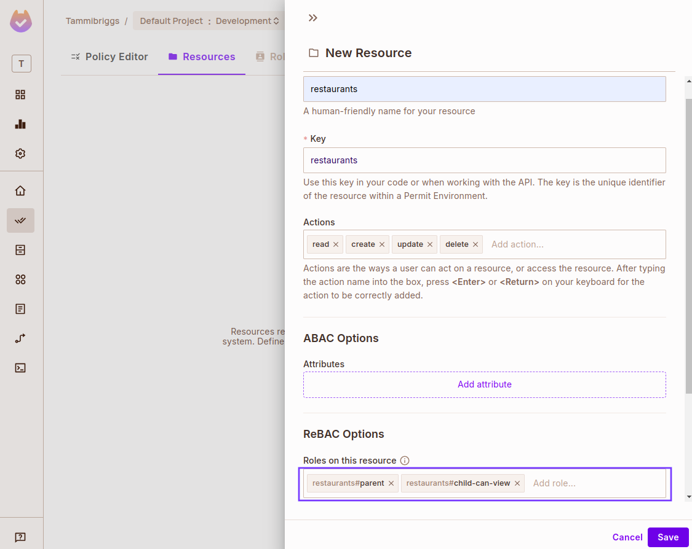
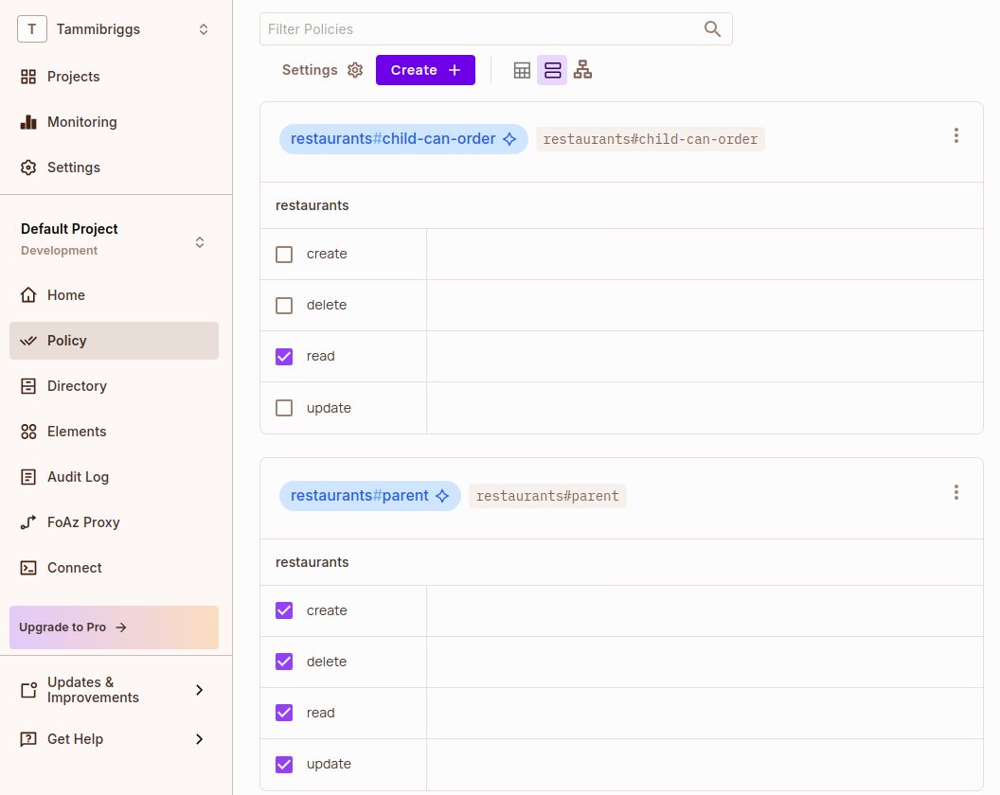
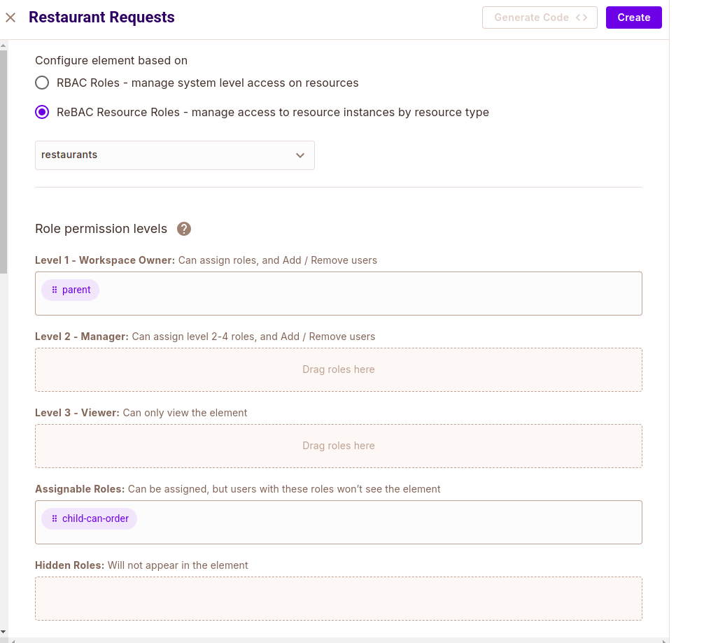
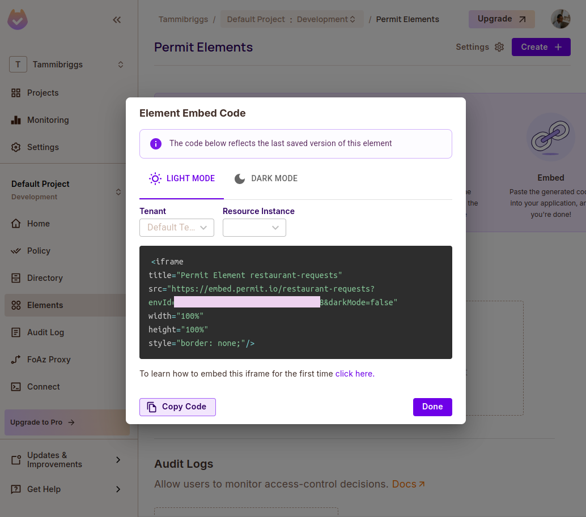
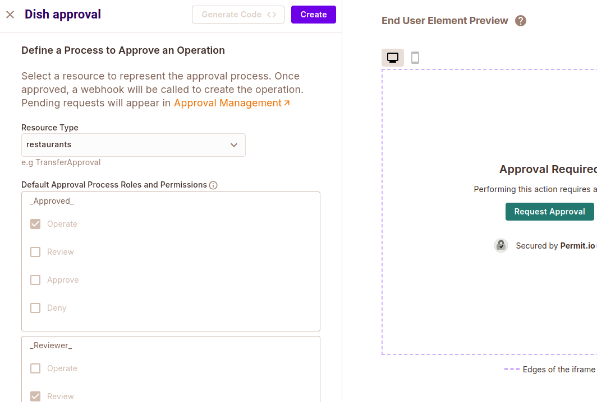
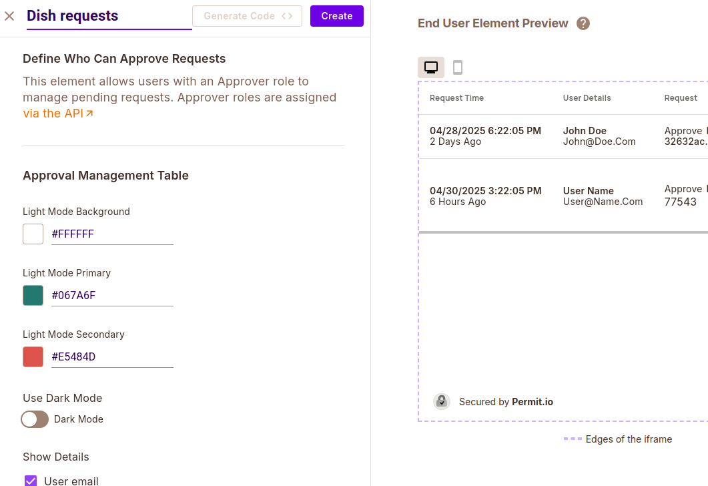

# Family food ordering

A chat in the terminal where family members order food from restaurants through an LLM
(Gemini). Parents and children sign in; the model works with the Permit MCP tools and two
tools of the app's own, and every one of those tools acts as the signed-in user. The app's
own tools and its seed command use the [Permit SDK](https://pypi.org/project/permit/) (`permit`)
with the same `PERMIT_*` settings as the MCP tools.

- Restaurants are instances of a `restaurants` resource type in Permit, with ReBAC roles. A
  child sees the menu of a restaurant only with the `child-can-view` role on it. For another
  restaurant, the child files an access request, and a parent approves or denies it.
- A child orders a dish above $10.00 only with a parent's one-time approval: an operation
  approval request on the restaurant. The order uses the approval up.
- Parents list, approve and deny the requests through the same chat.

## How the signed-in user reaches the tools

The backend authenticates the user, and the MCP tools act as that user through an identity
resolver bound in code. The model never names the user: no tool takes a user argument, and
the system instruction does not say who the user is.

1. `food-ordering-chat` posts the username and password to `POST /token`. The backend checks
   them against the database and returns a JWT, signed with `FOOD_ORDERING_JWT_SECRET`,
   whose subject is the username. The username is the user's Permit user key.
2. The chat opens the websocket `/ws/chat` with that token in the `Authorization` header. The
   backend verifies the token (an HS256 signature with its key, expiry, a known user) before
   it accepts the connection, and closes it with code 1008 otherwise. It also closes the
   connection with code 1008 when the token expires, 30 minutes after sign-in; sign in again
   to go on.
3. For the accepted connection, the backend builds an MCP server of its own
   (`food_ordering/session.py`), bound to that user:

   ```python
   identity = bound_user(user.username)
   PermitTools(settings, identity).register(server, exclude=...)
   FoodTools(db, permit, identity).register(server)
   ```

   It talks to that server through an in-process MCP client (`mcp.client.Client`). A
   child's server leaves out the reviewer tools.
4. Gemini sees the server's tools and asks for tool calls; the backend makes them through the
   session's client. Whatever arguments the model sends, a `user_id` included, every request
   to Permit is made as the session's user.

The app's own tools, `list_dishes` and `order_dish`, follow the same rule as the Permit tools:
they take the session's resolver, ask it for the caller on every call, and check permissions
with `permit.check` as that user. A caller who is no longer in the database is refused, even
in a session that is already open.

`order_dish` uses up a child's one-time approval: after the PDP allows `operate`, it removes
the `_Approved_` role with `permit.api.users.unassign_role`. The PDP can still allow `operate`
for a moment after that, so the removal decides: when Permit answers that there is no
approval to remove, the order is refused. One approval allows one order.

Why a server per session and `bound_user`: the backend and the MCP server run in one process,
and the backend already knows who the user is when the websocket opens. Binding the user when
the session's server is built fixes it for the session's lifetime, and nothing per call has
to carry it. The alternative, an MCP server over HTTP behind MCP authentication, where a
`TokenVerifier` checks the app's JWT and `access_token_subject()` acts as its subject, fits
when the MCP server runs apart from the backend; here it would add a network hop and a second
check of the same token.

## Set up Permit

### The resource and its roles

In the Permit dashboard, go to Policy, Resources, and create a resource `restaurants` with two
ReBAC roles, `parent` and `child-can-view`.



In the Policy Editor, give `parent` create, read, update and delete, and `child-can-view` read.



### The elements

Create a User Management element for the access requests:

- Name: Restaurant requests
- Configure elements based on: ReBAC Resource Roles
- Resource type: restaurants
- Role permission levels: level 1 (Workspace Owner) `parent`; assignable roles
  `child-can-view`



Its Get Code dialog shows its key, `restaurant-requests`: the value of
`PERMIT_ACCESS_REQUEST_ELEMENT`.



Create an Operation Approval element named "Dish approval" on the `restaurants` resource. It
adds two roles to the resource, `_Approved_` and `_Reviewer_`, and an `operate` action.



Then, in the Policy Editor, check that `restaurants#_Approved_` has the `operate` permission,
and grant it if not. `order_dish` asks the PDP for `operate` before it orders a dish above
$10.00 for a child, so without it every such order is refused, approved or not.

Create an Approval Management element named "Dish requests". Its key, `dish-requests`, is the
value of `PERMIT_OPERATION_APPROVAL_ELEMENT`.



## Set up the app

You need [uv](https://docs.astral.sh/uv/) 0.12.19 or newer and a
[Gemini API key](https://aistudio.google.com/app/apikey). The example installs `permit-mcp`
from this repository's checkout.

```shell
git clone https://github.com/permitio/permit-mcp
cd permit-mcp/examples/food-ordering-system
uv sync --locked
cp .env.example .env    # then fill it in
```

| Variable | Default | Meaning |
| --- | --- | --- |
| `PERMIT_API_KEY` | required | An environment-level Permit API key. |
| `PERMIT_RESOURCE` | required | `restaurants`. The app's own tools and the seed use it too. |
| `PERMIT_ACCESS_REQUEST_ELEMENT` | required here | `restaurant-requests`, the User Management element. |
| `PERMIT_OPERATION_APPROVAL_ELEMENT` | required here | `dish-requests`, the Approval Management element. |
| `PERMIT_TENANT` | `default` | The tenant of the restaurants and users. |
| `PERMIT_PDP_URL` | `https://cloudpdp.api.permit.io` | The PDP that answers permission checks. The cloud PDP evaluates ReBAC policies. |
| `FOOD_ORDERING_JWT_SECRET` | required | The key that signs and verifies sign-in tokens, at least 32 bytes, such as the output of `openssl rand -hex 32`. There is no default: the server does not start without it. |
| `FOOD_ORDERING_DB` | `food_ordering.db` | The SQLite database. |
| `GEMINI_API_KEY` | required | The Gemini API key. |
| `GEMINI_MODEL` | `gemini-3.8-flash` | The Gemini model. |

The `permit-mcp` settings are described in the
[repository README](../../README.md#configuration). `PERMIT_MCP_USER` is not used: each
session binds its own user.

Then create the database and the matching objects in Permit:

```shell
uv run --env-file .env food-ordering-seed
```

It creates the four restaurants as `restaurants` instances, with their names and whether
children may see them as attributes, and the four family members as users. Parents get
`parent` and `_Reviewer_` on every restaurant; children get `child-can-view` on Pizza Palace
and Burger Bonanza, the two restaurants open to children. Run again, it updates the
attributes of the restaurants that exist to match the database, and assigns only the roles
that are missing.

## Run it

Start the backend, which listens on `http://127.0.0.1:8000` (`--host` and `--port` change
that):

```shell
uv run --env-file .env food-ordering-server
```

It exits with status 2 and names the variable when the configuration is incomplete.

In another terminal, start the chat and sign in:

```shell
uv run food-ordering-chat
```

| Username | Password | Role |
| --- | --- | --- |
| `joe` | `joe_password` | parent |
| `jane` | `jane_password` | parent |
| `henry` | `henry_password` | child |
| `rose` | `rose_password` | child |

Try, as henry: "What can I eat at Pizza Palace?", "I want a pepperoni pizza", then, after
a parent approved the request, the same order again. Ask for Sushi World's menu to file an
access request. As joe: "Show me the pending requests" and "Approve it".

## The tools

| Tool | Parents | Children |
| --- | --- | --- |
| `list_resource_instances` | yes | yes |
| `check_permission` | yes | no |
| `create_access_request`, `create_operation_approval` | yes | yes |
| `list_*`, `approve_*`, `deny_*`, `cancel_*` of both kinds | yes | no |
| `list_dishes`, `order_dish` | yes | yes |

Permit decides what each user may do: a child's server leaves the reviewer tools out so that
the model does not offer them, and Permit refuses a review from someone without the reviewer
role either way.

## Tests

The tests run offline. The Permit API and PDP are a local stand-in that the MCP tools and the
Permit SDK both talk to, which answers as Permit does and records every request; the language
model is a scripted stand-in.

```shell
uv run pytest
uv run mypy
uv run ruff check . && uv run ruff format --check .
```

They check that each tool acts as the session's user on the Permit wire, that a `user_id` or
similar argument from the model changes nothing, that one approval allows one order, that
the server does not start without `FOOD_ORDERING_JWT_SECRET`, and the sign-in and websocket
authentication against a temporary database. ruff reads the repository root's configuration.
